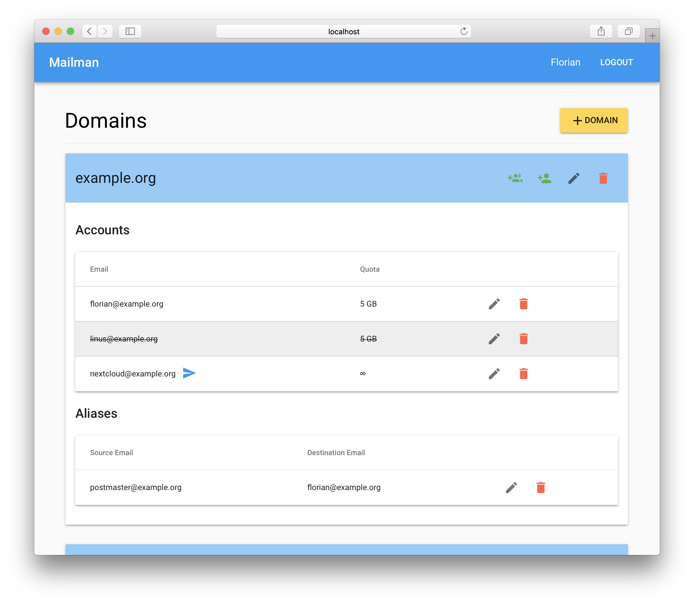

# Mailman

Mailman is a SPA written in React to help you to manage your email server database.



## Installation

### Install required build tools

```bash
sudo apt install build-essential python
```

### Install Node.js with nvm

```bash
curl -o- https://raw.githubusercontent.com/creationix/nvm/v0.33.6/install.sh | bash
```

After the installation of nvm you must logout and login again

Now you can install node

```bash
nvm install 9.1.0
```

Verify if node is available

```bash
$ node -v
v9.1.0

$ npm -v
5.5.1
```

### Install PM2 a Node.js process manager

```bash
npm i -g pm2
```

### Clone Mailman from GitHub

It is easiest if you clone Mailman in a non root user home directory.

```bash
git clone https://github.com/phiilu/mailman.git
```

### Build the app

```bash
cd mailman && npm install && cd client && npm install && cd - && npm run build
```

### Create a .env file

```bash
cp sample.env .env
```

Open .env with a text editor and update the environment variables with yours. 

To generate a random hash you can use command in your terminal:

```bash
head /dev/urandom | tr -dc A-Za-z0-9 | head -c 128 ; echo ''
```

### Start Mailman

```bash
npm start
```

Mailman is now running on port `4000`. If you wish to use a other port set a environment variable in .env file for example `PORT=50000`